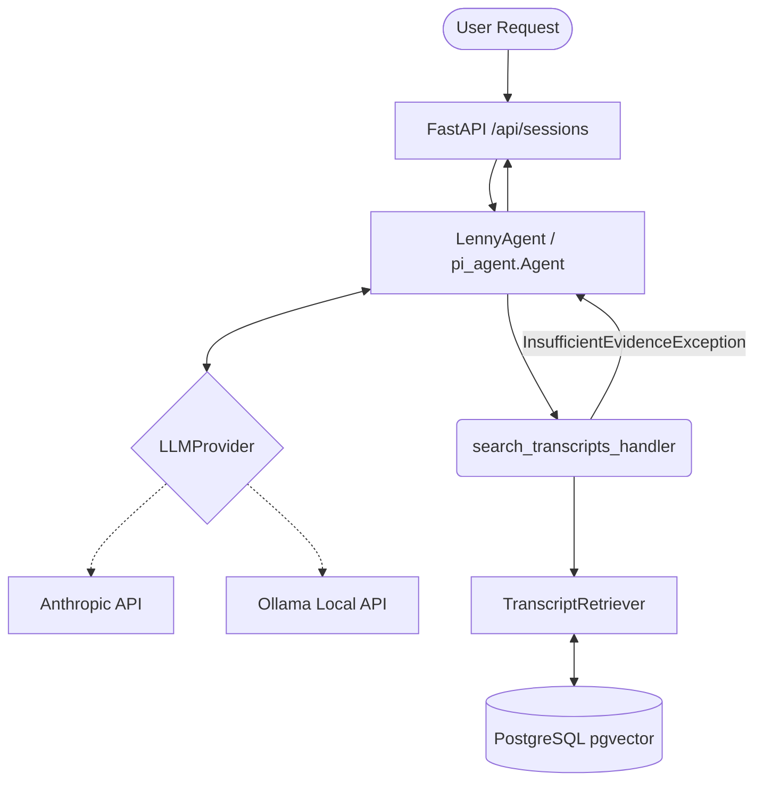

# Agent Architecture

## Why an agent is used
An agentic approach is required to translate open-ended user questions into deterministic queries against the knowledge base. Rather than blindly embedding the user's question and stuffing the context with unstructured text, the agent dynamically determines if it *needs* to search the transcripts, formulates a specific query based on conversational context, and evaluates the returned evidence.

## Required Agent Framework
The **Pi Coding Agent** (`pi_agent`) framework is utilized as the primary agent framework, satisfying the assignment requirements. We explicitly bypass unconstrained abstractions (like LangChain) to maintain strict deterministic boundaries.

`pi-coding-agent` natively supports both `AnthropicProvider` (via `anthropic` Python client) and `OpenAIProvider` (which perfectly maps to Ollama's local `/v1/chat/completions` endpoint). This completely unifies our agent loop, meaning the exact same tool execution routing powers both cloud and local models without needing parallel logic.

## Architecture

## Agent Tools
Currently, the agent is equipped with a single tool:
- `search_transcripts(query)`: Uses the Phase 2 `TranscriptRetriever` (pgvector cosine distance) to search for evidence.

## Retrieval Flow & Grounding Policy
Our grounding policy is implemented as an explicit **application-level contract**:
1. The Agent evaluates the conversation and calls `search_transcripts`.
2. The `TranscriptRetriever` executes the search against PostgreSQL (`pgvector`).
3. **Application Interception**: If the retriever returns `has_relevant_context=False` (due to results falling below the configured threshold), the application *deterministically* intercepts the response. It short-circuits the agent and responds: *"I could not find sufficient evidence..."*.
4. **LLM Evaluation**: If evidence is found, the structured results (including citation metadata) are passed back to the LLM. The LLM's system prompt explicitly instructs it to use *only* this evidence and never fabricate.

By enforcing the grounding threshold outside the LLM, we ensure the agent cannot hallucinate evidence when the database yields weak or irrelevant results.

## Session Context
Context is persisted in PostgreSQL. Conversations are isolated by `session_id`. To avoid schema bloat and context-window pollution, we only append raw user queries and final assistant answers to the context window for subsequent turns, omitting the raw JSON tool-calls.

## Provider Abstraction
- **Ollama/Local Mode**: Defaults to `llama3`. Uses `httpx` to hit `/api/chat` supporting the tools payload.
- **Anthropic Mode**: Defaults to `claude-3-haiku-20240307`. Uses `AsyncAnthropic` client.

## Error Handling & Observability
- Missing API keys yield structured 503 errors (`LLM_UNAVAILABLE`).
- LLM timeouts and HTTP errors are caught and surfaced cleanly.
- `structlog` is utilized to emit observable metadata (latency, provider, model) without leaking full transcript chunks or API keys into standard output.
